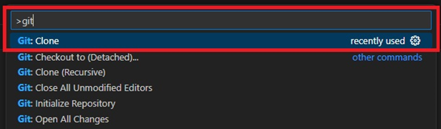
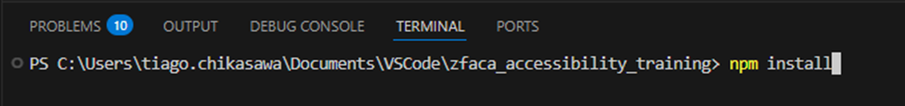
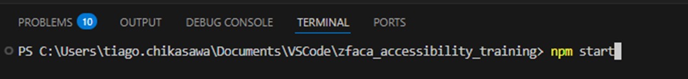
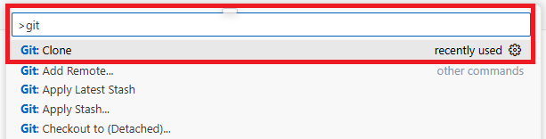
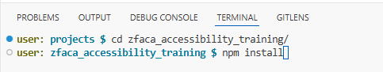
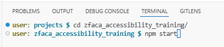

# ZFACA_ACCESSIBILITY


## VSCode

### Initial Configuration

1. Download and Install Git:​
    * https://git-scm.com/downloads​

2. Download and Install latest (LTS) version of NodeJS:​
    * https://nodejs.org/en/download​

3. Download and Install Visual Studio Code (User Installer):​
    * https://code.visualstudio.com/Download

4. Install Fiori Tools (VSCode Extension):
    * In the extensions menu on VSCode, search and install "SAP Fiori Tools – Extension Pack"​

        

5. Open the windows command prompt (or Git Bash if you selected not to use the standard Git Windows Command Prompt during the Git installation) and run the command:
    * To be able to push from your computer, you need to configure your username and email locally:
        ```
        git config --global user.name "LASTNAME Firstname"
        git config --global user.email "xxxx@vinci-energies.com"
        ```
    * Set SSL certificate to false:
        ```
        git config --global http.sslVerify false
        ```

6. Open VSCode:
    * In the search bar type:
        ```
        >Git: Clone
        ```
        

    * Paste the git repository URL: https://gitlab1.vinci-energies.net/vesi/codex/developments/domains/cross-application/fiori/zfaca_accessibility_training.git

    * Open the terminal (Terminal -> New Terminal)

    * Make sure you are in the project folder

    * Install packages from the npm:
        ```
        npm install
        ```
        

### Launch the App

On VSCode:
* Open the terminal (Terminal -> New Terminal)

* Make sure you are in the project folder

* Launch the app:
    ```
    npm start
    ```
    

## BAS​

### Initial Configuration

Open BAS:
* Open the terminal (Terminal -> New Terminal)
    * To be able to push from your computer, you need to configure your username and email locally:
        ```
        git config --global user.name "LASTNAME Firstname"
        git config --global user.email "xxxx@vinci-energies.com"
        ```

* In the search bar type:
    ```
    >Git: Clone
    ```
    

* Paste the git repository URL: https://gitlab1.vinci-energies.net/vesi/codex/developments/domains/cross-application/fiori/zfaca_accessibility_training.git

* Open the terminal (Terminal -> New Terminal)

    * Make sure you are in the project folder

    * Install packages from the npm:
        ```
        npm install
        ```
        

### Launch the App

On BAS:
* Open the terminal (Terminal -> New Terminal)

* Make sure you are in the project folder

* Launch the app:
    ```
    npm start
    ```
    